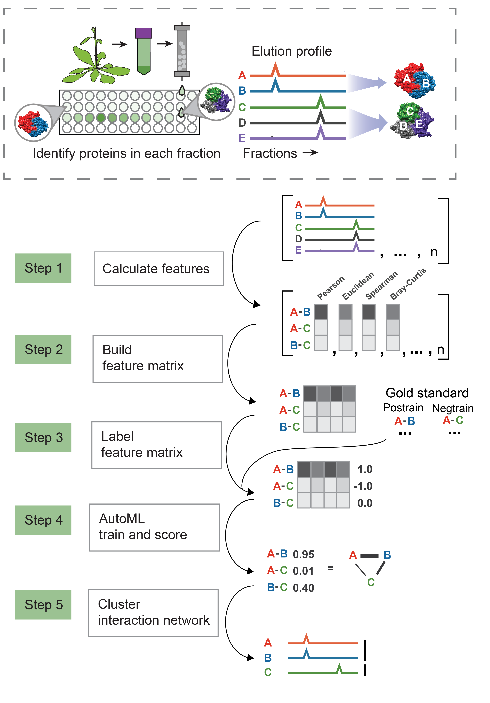

# cfmsflow

cfmsflow is a Nextflow pipeline to determine protein-protein interactions and complexes from protein elution profiles.  



The pipeline is divided into 5 main steps. To summarize, these steps are to 1) Calculate similarities between protein elution profiles, 2) Combine similarity scores into a feature matrix, 3) Label the feature matrix with gold standard protein-protein interactions, 4) Train a model to detect and score pairwise protein interactions, 5) Cluster the resulting protein interaction network into complexes.  

By default, the pipeline begins at step 1 (calculating protein profile similarities) and continues through step 5 (detect complexes), however, a subset of steps or individual steps may be run as set in the user parameter file. 


## Installation


1. Install nextflow onto a Linux-based operating system 

Install [nextflow (dsl2)](https://www.nextflow.io/docs/latest/getstarted.html)

2. Clone this repository
```
git clone https://github.com/marcottelab/cfmsflow.git
```


## Usage

Elution files from one or more separation experiments are the main data inputs to cfmsflow.

Examples of all input file formats are provided in the test_input directory.

First test your local pipeline by running examples. Look for successfuly completion of the following command in 5-10 minutes, with output in the test_output directory. 
```
nextflow main.nf -params-file example_params/example_wholepipeline.json 
```

Due to variability in parameters needed to run different portions of the pipeline, we provide a script that will generated a parameters json file containing only parameters that are required for the selected steps. 

To generate a template parameters file for all steps, use
```
nextflow main.nf -params-file generate_params.json --entrypoint 1 --exitpoint 5 
```

This will create a file called user_parameters.json, which should be renamed to avoid overwritting. 

As another example, to generate parameters for only steps 4 and 5 using already already generated positive and negative ppi sets from a previous run. 

```
nextflow main.nf -params-file generate_params.json --entrypoint 4 --exitpoint 5 --using_existing_goldstandard true
```


Modify the generated user_parameters.json, filling out all empty parameters with local files and modifying any desired default parameter values. 

Then run with:
```
nextflow main.nf -params-file user_parameters.json 
```


### Notes

 - To resume running a pipeline after fixing an error or changing a parameter value, run the same command as above with additionally –resume to run all steps downstream of the parameter change. 
 - After errors, check format of input files against format of corresponding files in test_input/
 - For discrete count-based measures such as peptide-spectral matches (PSMs), correlations may be run for N repetitions with poisson noise, and scores averaged, controlled by the parameter `added_poisson_reps = N`. Intensity-based measures should use the default value of add_poisson_reps = 0. 


### Examples of workflows

A user would first run the entire pipeline. Then..

- Finding the model overtrained, run just steps 4 and 5 on the labeled feature matrix produced in the initial run, reducing the value of max_features_to_select.

To do this, you would first run `nextflow main.nf -params-file generate_params.json --entrypoint 4 --exitpoint 5 --using_existing_goldstandard true`. Then fill in the input parameters with the path to the labeled feature matrix and gold standard sets produced in the initial run. Note: change output_dir parameter to compare new training to previous output. Rename the user_parameters.json and then run `nextflow main.nf –params-file user_parameters_XX_XX_XX.json`


- Finding poor protein interaction quality, run steps 3 through 5, using a different set of gold standard and the feature matrix produced in the initial run. 

- Finding too few or too many proteins in the clustered output, run just step 5, increasing or decreasing the fdr_cutoff value. 

### Troubleshooting 

- First, check for any messages about missing parameters printed to screen

- Confirm that formats of input files match example_input files


Failure at TPOT training:cfmsinfer_scan

"RuntimeError: There was an error in the TPOT optimization process. This could be because the data was not formatted properly (e.g. nan values became a third class) or because data for a regression problem was provided to the TPOTClassifier object. Please make sure you passed the data to TPOT correctly."

Change to the stated work directory and confirm that training matrix contains both positive ",1.0," and negative ",-1.0," in the second to last column.


## Parameters
   

### Parameters to control generating parameters (generate_params.json)

#### entrypoint
Which step in the pipeline to begin. Default: 1

#### exitpoint
Which step in the pipeline to stop. Can be the same as entrypoint if only running one step. Default: 5

#### using_existing_goldstandards
true/false. Set to true if you're going to be using goldstandard ppi sets (postrain, negtrain, postest, negtest, complexgrouping) that have already been generated. If false, parameters needed to construct gold standard sets will be generated. Default: false 


#### make_parameter_json  
Whether to save a json file of generated paramters. Default:true

#### expose_docker_paths  
Whether to show paths used to access elements of the Docker environment. Default: false


### User parameters

#### output_dir
Where to put output. Suggested to making unique to each run to avoid overwriting output from previous run. Default: output/

#### tpot_template  
Template for TPOT training. Default: 'Selector-Classifier'. Currently only 'Classifier' or 'Selector-Classifier' allowed. 

#### postrain  
File of ppis, two protein IDs space separated, no header. Example: test_input/postrain

#### postest  
File of ppis, two protein IDs space separated, no header. Example: test_input/postest

#### negtrain  
File of ppis, two protein IDs space separated, no header. Example: test_input/negtrain

#### negtest  
File of ppis, two protein IDs space separated, no header. Example: test_input/negtest

#### complexgrouping
File designating which training ppis come from the same complex. This file is used to tell TPOT to not split members of the same complex into different cross validation groups, which substantially helps with overtraining. 

#### input_elution_pattern  
A regex pattern matching elution files to be processed. Only one of input_elution_pattern and input_elution_file can be used in the user parameter file. Only used when entrypoint = 1. Ex. test_input/*wide

Elution files are comma separated tables with header, where the first column (named ID) contains protein identifiers, and the following columns contain protein quantification in each fraction.  Values can be any metric, such as Peptide Spectral Matches, peptide peak area or precursor ion intensity.


#### input_elution_file  
A file containing paths to elution files to be processed. Only one of input_elution_pattern and input_elution_file can be used in the user parameter file. Only used when entrypoint = 1. Ex. test_input/elutionlist.txt

#### input_features_pattern  
A regex pattern matching features to be joined into a feature matrix. Only one of input_features_pattern and input_features_file can be used in the user parameter file. Only used when entrypoint = 2. Ex. test_input/*feat.ordered

#### input_features_file  
A file containing paths to features to be joined into a feature matrix. Only one of input_features_pattern and input_features_file can be used in the user parameter file. Only used when entrypoint = 2. Ex. test_input/featurelist.txt

#### existing_feature_matrix  
A file containing an already generated feature matrix. Only required if entrypoint > 3 and exitpoint < 5. Ex. test_input/featmat


#### existing_labeled_feature_matrix 
A file containing an already generated feature matrix with a label column of positive and negative gold standard interactions(1/-1). Only required if entrypoint > 3 and exitpoint < 4. Ex. test_input/featmat_labeled

#### goldstandard_complexes  
#### negtrain  
File of ppis, two protein IDs space separated, no header. Example: test_input/negtrain

#### negtest  
File of ppis, two protein IDs space separated, no header. Example: test_input/negtest

#### complexgrouping
File designating which training ppis come from the same complex. This file is used to tell TPOT to not split members of the same complex into different cross validation groups, which substantially helps with overtraining. 

#### input_elution_pattern  
A regex pattern matching elution files to be processed. Only one of input_elution_pattern and input_elution_file can be used in the user parameter file. Only used when entrypoint = 1. Ex. test_input/*wide

#### input_elution_file  
A file containing paths to elution files to be processed. Only one of input_elution_pattern and input_elution_file can be used in the user parameter file. Only used when entrypoint = 1. Ex. test_input/elutionlist.txt

#### input_features_pattern  
A regex pattern matching features to be joined into a feature matrix. Only one of input_features_pattern and input_features_file can be used in the user parameter file. Only used when entrypoint = 2. Ex. test_input/*feat.ordered

#### input_features_file  
A file containing paths to features to be joined into a feature matrix. Only one of input_features_pattern and input_features_file can be used in the user parameter file. Only used when entrypoint = 2. Ex. test_input/featurelist.txt

#### existing_feature_matrix  
A file containing an already generated feature matrix. Only required if entrypoint > 3 and exitpoint < 5. Ex. test_input/featmat


#### existing_labeled_feature_matrix 
A file containing an already generated feature matrix with a label column of positive and negative gold standard interactions(1/-1). Only required if entrypoint > 3 and exitpoint < 4. Ex. test_input/featmat_labeled

#### goldstandard_complexes  
A file of complexes, with each complex member separated by a space. Ex. test/goldstandard_complexes.txt

#### merge_threshold  
Jaccard similarity threshold on which to merge similar complexes. 1.0 will only remove exact copies. Default 0.6


#### complex_size_threshold  
Threshold large complexes in gold standard set to this size. Prevents very large complexes from making up most ppi pairs. Default: 30

#### negatives_from_observed  
true/false. If true, generate 'negative' ppis from observed pairs of proteins from the feature matrix. If false, generate 'negative' ppi from faux interactions between different gold standard complexes. Default: true:

#### negative_limit  
Limit numbers of negatives interactions to this number. Default: 20000

#### added_poisson_reps  
Perform repeated sampling with added poisson noise when generating features from elution files during step 1. For count-based data, we use 5 or 100 repetitions depending on data size. Default:0

#### classifiers_to_scan  
Which sklearn classifiers for TPOT to scan for optimal model. Default: accessory_files/classifier_subset.txt

#### selectors_to_scan  
Which sklearn feature selection to use with TPOT. Default: accessory_files/selector_subset.txt

#### generations  
Number of generations for TPOT scan. Default: 10

#### population  
Population for TPOT scan. Default: 20

#### n_jobs  
TPOT n_jobs. Default: 20

#### cv
TPOT number of rounds of cross-validation

#### max_features_to_select  
Limit TPOT to using a model with maximum this number of features. If model is overtrained, reduce this number. Default:50

